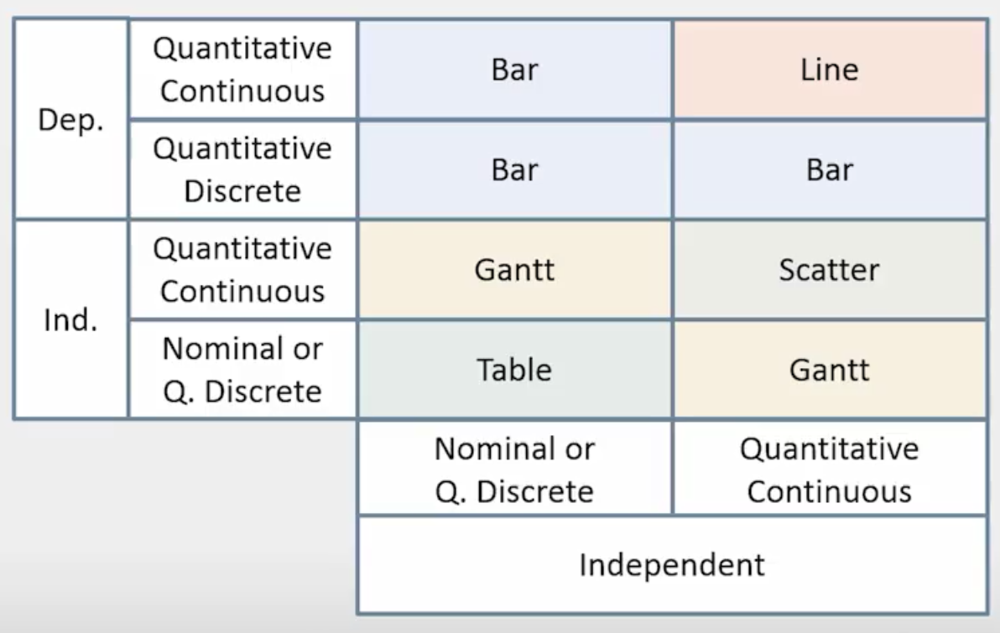

## Introduction

This is my Data Visualization Programming Assignment 01 product. 

**If you are a peer reviewer fell free to jump straight to the "Chart"**, the rest of this document tells the step-by-step to read, clean and prepare the plot using [R notebooks](http://rmarkdown.rstudio.com/r_notebooks.html) and [Plotly](https://plot.ly/r/).


## Assignment Overview

This assignment will give you a chance to explore the topics covered in Week 2 of the course by visualizing some data as a chart. The data set we provided deals with world temperatures and comes from NASA. You are welcome to use the additional resources, especially if you do not want to program to complete this project.

## Instructions

### 1. Taking data set

Take the data from the GISTEMP site, specifically the data from "Table Data: Global and Hemispheric Monthly Means and Zonal Annual Means." Alternatively you can use any data that you would like to explore instead.

### 2. Parsing dataset

```{r parsing, echo=T}

# loading dataset
gistemp <- read.csv("./data/ExcelFormattedGISTEMPData2CSV.csv")
dim(gistemp) # dimension
str(gistemp) # what is this structure?

```

The dataset contains annual means of temperatures, likely to be Global averages, North and South averages and some latitudinal zones.

Let's caracterize some data

```{r temperatureUnit, warning=FALSE, message=TRUE}

summary( gistemp[, c("Glob","NHem", "SHem")] )

```

These temperatures are too high (or too low) to be in Celsius?

### 3 Visualize the data

Let's define the char type using the rules from the classes:



In your case we have:

* Independent Variable: **YEAR** (Quantitative Discrete)
* Dependent Variable: **Temperature** (Quantitative Continuous)

So, following the recommendation table we should use **Bar Chart**. 

## Chart

```{r simpleBar, warning=FALSE, message=FALSE}

library(plotly)
library(magrittr)

# dataset and x var
chart <- plot_ly(gistemp, x=~Year) %>% 

          # Global Average
          add_trace( y=~Glob, type = 'bar', name="Global Average") %>%

          # naming Y axix
          layout( yaxis=list(title="Temperature °C", ticksuffix=" °C"),
                  title="Global Average Temperature")


chart


```

### Questions to be answered about the visualization

**What are your x- and y-axes?**

We are using Year in the X-Axis and Global Average Temperature (*Glob*) in the Y-Axis.

**Did you use a subset of the data? If so, what was it?**

We are using all data-pints but only the Year and Glob columns, we tried plot the other columns together using bar chart but the information became difficult to see.

**Are there any particular aspects of your visualization to which you would like to bring attention?**

I think besides the dependent variable be a quantitative discrete (years), there is so many years (if you use all data points), that you can consider plot a line chart as well, like years could be a quantitative continuous without losing information.

**What do you think the data and your visualization show?**

The chart shows that the global average temperature oscillate a lot, year by year, but there is a continuous trend of increasing since around 1910.


## Extension

In this section I explore other type of charts in this dataset only to check the possibilities. **If you are a peer reviewer, you can disconsider the remaining of this document**.

#### Line chart

Trying to see the same information treating Year as continuous data and choosing a line chart:

```{r lineChart, warning=FALSE, message=FALSE}
# dataset and x var
chart <- plot_ly(gistemp, x=~Year) %>% 

          # Global Average
          add_trace( y=~Glob, type = 'scatter', mode="line", name="Global Average") %>%

          # naming Y axix
          layout( yaxis=list(title="Temperature °C", ticksuffix=" °C"),
                  title="Global Average Temperature")


chart
```

**This is a good chart too**. It is easy to assume that between data points there is a continuous change of temperature. We can see clearing the Year-to-Year oscillation and the increasing trend. 

#### Ploting more data toghether 

```{r barMultiplePlot, warning=FALSE, message=FALSE}

# dataset and x var
chart <- plot_ly(gistemp, x=~Year) %>% 

          # North Hemisphere Temperature
          add_trace( y=~NHem, type = 'bar', name="North Hemisphere") %>%

          # Global Average
          add_trace( y=~Glob, type = 'bar', name="Global Average") %>%

          # South Hemisfere Temperature
          add_trace( y=~SHem, type = 'bar', name="South Hemisphere") %>%
  
          # naming Y axix
          layout( yaxis=list(title="Temperature", ticksuffix=" °C"))


chart
```

**This chart is bad**. It is difficult to see any relationship between the temperatures, basically we only see (with noise) the same information if we are plotting the Global average.

Maybe if we differences from average we can see something different.

```{r diference, warning=FALSE, message=FALSE}

# removing global average from North and South Hem. Temperatures
gistemp$NorthDiff = gistemp$NHem - gistemp$Glob 
gistemp$SouthDiff = gistemp$SHem - gistemp$Glob

# dataset and x var
chart <- plot_ly(gistemp, x=~Year) %>% 

          # North Hemisphere Temperature
          add_trace( y=~NorthDiff, type = 'bar', name="North Hemisphere") %>%
          # South Hemisfere Temperature
          add_trace( y=~SouthDiff, type = 'bar', name="South Hemisphere") %>%
          # naming Y axix
          layout( yaxis=list(title="Temperature Amplitude", ticksuffix=" °C"),
                  title="Temperature Difference from Global Average")


chart

```

Now we can see a an pattern can be explored! In certain times, with several years in a row, the South Hemisphere is hotter than North Hemisphere (from 1880 to 1920 and 1969 to 1992) and other intervals the North is hotter than South, from Global Average. Is this a real pattern?

Can we view this pattern in others columns, let's see the diference from North to South in different latitudes

```{r}

gistemp$diff.EQU.24 <- gistemp$EQU.24N - gistemp$X24S.EQU
gistemp$diff.24.44 <- gistemp$X24N.44N - gistemp$X44S.24S
gistemp$diff.44.64 <- gistemp$X44N.64N - gistemp$X44S.24S
gistemp$diff.64.90 <- gistemp$X64N.90N - gistemp$X90S.64S


# dataset and x var
chart <- plot_ly(gistemp, x=~Year) %>% 

          # North Hemisphere Temperature
          add_trace( y=~diff.EQU.24, type = 'scatter', mode="line", name="EQ-24") %>%
          # South Hemisfere Temperature
          add_trace( y=~diff.24.44, type = 'scatter', mode="line", name="24-44") %>%

          # South Hemisfere Temperature
          add_trace( y=~diff.44.64, type = 'scatter', mode="line", name="44-64") %>%

          # South Hemisfere Temperature
          add_trace( y=~diff.64.90, type = 'scatter', mode="line", name="64-90") %>%

 # naming Y axix
          layout( yaxis=list(title="Temperature Amplitude", ticksuffix=" °C"),
                  title="Temperature Difference in Latitudes")


chart


```

This chart is bad to see all together, but you can turn off some of them dinamically. In this chart we can see the cycles where one hemisphere is hotter than other, same patter saw in last chart.