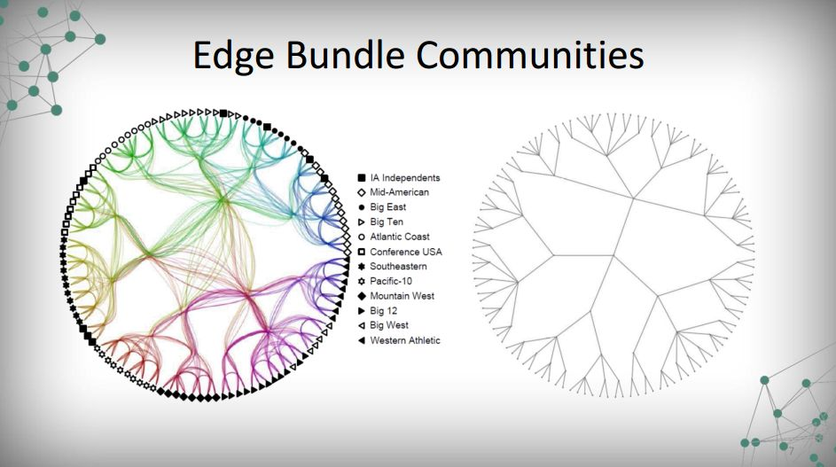

## Overview

If you are Peer Reviewer you can jump straight to the "Chart" section in this document.

This assignment of **[Data Visualization Course](https://www.coursera.org/learn/datavisualization/home/welcome)** @ [Coursera](http://www.coursera.org) meant to give you the opportunity to do non-coordinate data visualization, specifically using a network of your choosing.

## Goals

Network data lends itself easily to graph visualization. This assignment will allow you to explore the means of network visualization that you have encountered in the course, to decide how best to visualize data, and to analyze other network visualizations.

In this document, first I'll try to get a good and representative visualization of a graph and to try explore and reproduce the visualization one of the slides were **John Hart** uses [Betweenness Centrality](https://en.wikipedia.org/wiki/Betweenness_centrality) to clusterize the college football teams and reconstruct the team's divisions (video_3.1.3-slide_7):



## Instructions

### 1. Find & choose data

Find some network data that you think is suitable and that you would like to visualize. Here are some sites that provide links to a wide variety of different graph/network data sets:

* [Stanford Large Network Dataset Collection](http://snap.stanford.edu/data/index.html)
* [UCI Network Data Repository](https://networkdata.ics.uci.edu/index.php)

We'll use the [UCI's American College Football](https://networkdata.ics.uci.edu/data.php?id=5) data set. There are one [GML format](https://en.wikipedia.org/wiki/Graph_Modelling_Language) file, we'll download this data set.

```{r download}
# setup packages
library(needs)
needs(RCurl)
needs(igraph)
needs(plotly)
needs(RColorBrewer)

# download dataset if necessary
if(!file.exists("./data")){
  dir.create("./data")
  file <- getURL("http://networkdata.ics.uci.edu/data/football/football.gml")
  write(file,"./data/football.gml")
  rm(file);gc()
}
```


### 2. Choose a platform

Choose a visualization platform and parse the data into a format suitable for the tools you will use. We'll use **[R Notebooks](https://rmarkdown.rstudio.com/r_notebooks.html)**, **[igraph package](http://igraph.org/r/)** and **[Plotly](https://plot.ly/r/)**.

## Creating the visualizations

### 1.Loading dataset

```{r loading}
# loading
graph <- graph <- read_graph("./data/football.gml", format = "gml")

# how much verticies and edges

edges <- length(E(graph))
verts <- length(V(graph))

```

The data set has **`r verts`** vertices and **`r edges`** edges.

### 2. Preliminary visualizations

Plotting the graph:

```{r preChart}
# plot
plot(graph)
```

This is a bad visualization. We didn't define a layout and we can't see any structure. Let's define a circle layout and remove the labels temporally:

```{r circleLayout}

# circle layout
serialCircle <- layout_in_circle(graph)
plot(graph, layout=serialCircle, vertex.label=NA, vertex.size=6)

```


We remove the vertices super-positions, but we can see any structure in the data set. The reasons to that are we put the vertices in the circle following no specific order and there a lot of edges (`r edges`).

### 4. Seeing the structure

In the graph data set downloaded from UCI, also there are [the information about the team's conferences](http://networkdata.ics.uci.edu/data/football/football.txt), as describe bellow.

> The file football.gml contains the network of American football games between Division IA colleges during regular season Fall 2000, as compiled by M. Girvan and M. Newman.  The nodes have values that indicate to which conferences they belong.  The values are as follows:
> 
> 0 = Atlantic  <br>
> 1 = Big East  <br>
> 2 = Big Ten  <br>
> 3 = Big Twelve  <br>
> 4 = Conference USA  <br>
> 5 = Independents  <br>
> 6 = Mid-American  <br>
> 7 = Mountain West  <br>
> 8 = Pacific Ten  <br>
> 9 = Southeastern  <br>
> 10 = Sun Belt  <br>
> 11 = Western Athletic  <br>

Let's try to use this to order the team in the circle visualization

```{r orderDivision}
confCircle <- layout_in_circle(graph, order=order(V(graph)$value))
plot(graph, layout=confCircle, edge.curved=.5, vertex.label=NA, vertex.size=6)
```

Nice, we can now see the some structure in the chart.

## Chart

Now, lets, put some decorations to make more easily see the teams conference organizations

```{r orderDivisionColor}

# graph layout
confCircle <- layout_in_circle(graph, order=order(V(graph)$value))

my.palette <- brewer.pal(n = 12, name = "Set3")

# plot command
plot( graph, 
      layout=confCircle, 
      edge.curved=.5, 
      vertex.label=NA, 
      vertex.size=6, 
      vertex.color=my.palette[1+V(graph)$value],
      main="College Football games and Conferences (fall/2000)"
    )

# legend
leg.txt <- c("Atlantic Coast","Big East","Big Ten","Big Twelve","Conference USA",
            "Independents","Mid-American","Mountain West","Pacific Ten","Southeastern",
            "Sun Belt","Western Athletic")


leg <- legend(x=-2.5, y=1, leg.txt, title = "Conferences", fill = my.palette)
```

### Questions about the chart

**What is the data that you chose? Why?**

The [UCI's American College Football](https://networkdata.ics.uci.edu/data.php?id=5) data set was choose because of team's division structure, I would like to see if it's possible to visualize this structure in a graph chart.

**Did you use a subset of the data? If so, what was it?**

No the whole data set

**Did you use a subset of the data? If so, what was it?**

The chart is too dense, if you plot the vertices without structure we can't see anything, but putting the vertices in a order of the divisions we can see a structure.

**What do you think the data and your visualization show?**

The vertices form clusters, we can see checking the density of edges inside this clusters. This clusters represents the team division and the more frequent games inside a division than between them, as should be.

## Extensions

In this section I'll try to use [Betweenness Centrality](https://en.wikipedia.org/wiki/Betweenness_centrality) to clusterize the college football teams and reconstruct the team's divisions.

If you are a Coursera's peer reviewer, you can ignore the remaining document.

### Clustering using Betweenness

To handle with the problem with the visualizations above, we'll try apply cluster the vertices using **[Betweennes Centrality](https://en.wikipedia.org/wiki/Betweenness_centrality)**. 

```{r clustering}

# clustering
ceb <- cluster_edge_betweenness(graph)

# how many clusters?
n_cluster <- length(communities(ceb))

```

We found **`r n_cluster` clusters**. Lets see the graph colored by cluster.

```{r colorCluster}
plot(graph, layout=serialCircle, vertex.label=NA, vertex.size=6, vertex.color=membership(ceb))

```

As we predict, we put the vertices at the circle following no order, lets use the clustering information to organizing the vertices along the circle.

```{r layoutCluster}

clusterCircle <- layout_in_circle(graph, order=order(membership(ceb)))
plot(graph, layout=clusterCircle, edge.curved=.5, vertex.label=NA, vertex.size=6, vertex.color=membership(ceb))

```


### Removing Edges

Now we see an structure, the center of the graph is now more clean and it's possible visualize the "conferences". We can "clean up" the edges removing the highest betweenness edges. Lets view the edges betweenness distribution.

```{r edgeBetween}
ebc <- edge_betweenness(graph, e = E(graph))
hist(ebc, breaks=50, col="Red")
summary(ebc)
```

To clean up the edges, We'll remove 1/4 of the edges (the highest edge betweenness). 

```{r removeEdge}

# threshold (3rd Quartile)
th <- summary(ebc)[5]
toRemove <- which(ebc>th)
graph2 <- delete_edges( graph, toRemove)
plot(graph2, layout=clusterCircle, edge.curved=.5, vertex.label=NA, vertex.size=6, vertex.color=membership(ceb))

```

Very good representation, we now see the games intoween the conferences and some games between then. 

### Clusters and Conferences

The clusterization not detect all divisions, from the 12 division we only found `r n_cluster` but is a good approximation.

```{r}

teams.conf <- V(graph)[order(membership(ceb))]$value
teams.clst <- membership(ceb)[order(membership(ceb))]

comp <- unique(data.frame(
  Conferencia    = leg.txt[1+teams.conf],
  Cluster.Number = teams.clst
))


knitr::kable(comp, caption = "Conferences and Clusters", row.names = F)

```

We can see now, how the clustering merge together some conferences. Atlantic Coast, Big Ten and Conference USA was well defined, but others conferences was mixed in some level.

### Visualizing the Diferences

```{r plotlyGraph, warning=FALSE, message=FALSE}

# verticies cordinates
Xn <- clusterCircle[,1]
Yn <- clusterCircle[,2]

# verices
vs <- V(graph)
es <- as.data.frame(get.edgelist(graph))

Nv <- length(vs)
Ne <- length(es[1]$V1)

# edges 
edge_shapes <- list()
for(i in 1:Ne) {
  v0 <- es[i,]$V1
  v1 <- es[i,]$V2

  edge_shape = list(
    type = "line",
    line = list(color = "#AAAAAA", width = 0.3),
    x0 = Xn[v0],
    y0 = Yn[v0],
    x1 = Xn[v1],
    y1 = Yn[v1]
  )

  edge_shapes[[i]] <- edge_shape
}

# clean grid in chart
axis <- list(title = "", showgrid = FALSE, showticklabels = FALSE, zeroline = FALSE)

# colors & symbols
getPalette <-  colorRampPalette(brewer.pal(12, "Paired"))
symbols <- c("circle","square","diamond","triangle-up",
             "triangle-down","cross","x","star-square",
             "circle-x","pentagon-dot","triangle-right","triangle-left")

network <- plot_ly(x = ~Xn, y = ~Yn, 
                   mode = "markers", 
                   text = paste0("Team: ",V(graph)$label, "<br> Cluster: ",
                                 membership(ceb),"<br> Conference:", 
                                 leg.txt[1+V(graph)$value]),
                   name = leg.txt[1+V(graph)$value],
                   hoverinfo = "text",
                   symbol = symbols[1+V(graph)$value], 
                   color = getPalette(12)[membership(ceb)], 
                   marker=list(size = 10)) %>%
  layout( xaxis = axis, yaxis = axis, showlegend = FALSE, shapes = edge_shapes,
          title = "American College Football Clusters")

network

```

In this visualizations, finally we can see the clustering information and the actual team's conference.
